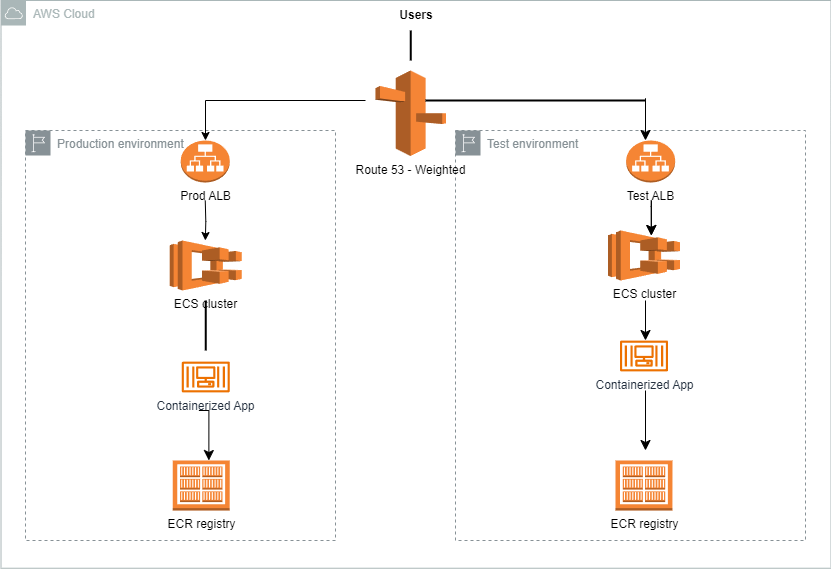

# AWS Microservices Deployment with ECS, Fargate, ALB, and Route 53

This project implements a scalable, serverless architecture for deploying containerized microservices in AWS using Amazon ECS, Fargate, Elastic Load Balancer (ALB), and Route 53. The architecture includes weighted traffic distribution between production and testing environments, allowing gradual testing and rollout of new features.

---

## **Table of Contents**
- [Project Purpose](#project-purpose)
- [Architecture Overview](#architecture-overview)
- [Features](#features)
- [Prerequisites](#prerequisites)
- [Project Structure](#project-structure)
- [Usage Instructions](#usage-instructions)
  - [Step 1: Clone the Repository](#step-1-clone-the-repository)
  - [Step 2: Configure Variables](#step-2-configure-variables)
  - [Step 3: Initialize Terraform](#step-3-initialize-terraform)
  - [Step 4: Plan the Deployment](#step-4-plan-the-deployment)
  - [Step 5: Apply the Deployment](#step-5-apply-the-deployment)
- [License](#license)
- [Contact](#contact)
- [Acknowledgments](#acknowledgments)

---
## **Project Purpose**
This project presents the case of a company that's running a traditional web application on Amazon EC2 instances. The company needs to refactor the application as microservices that run on containers. Separate versions of the application exist in two distinct environments: production and testing. Load for the application is variable, but the minimum load and the maximum load are known. A solutions architect needs to design the updated application with a serverless architecture that minimizes operational complexity.
The team of solution architects has decided to:
- Configure a route 53 with a weighted routing policy that directs a certain percentage of traffic to         production environment (e.g: 80%) and another to testing environment (e.g: 20%).
- Upload the container images to Amazon Elastic Container Registry (Amazon ECR).
- Configure two auto scaled Amazon Elastic Container Service (Amazon ECS) clusters with the Fargate launch type to handle the expected load. Deploy tasks from the ECR images.
- Configure two separate Application Load Balancers to direct traffic to the ECS clusters.
The goal of this project is to realize this architecture and deploy it using terraform.
The purpose of this project is to: 
1. Refactor a traditional web application running on Amazon EC2 into microservices running on AWS ECS with Fargate. 
2. Use a serverless architecture to minimize operational complexity. 
3. Implement weighted traffic distribution for testing new features. 
4. Ensure high availability, scalability, and efficient traffic management.

---

## **Architecture Overview**


The project consists of the following components:
1. **Amazon ECR**: Stores Docker container images for production and testing environments.
2. **Amazon ECS with Fargate**: Runs containerized tasks in a serverless environment.
3. **Elastic Load Balancers (ALBs)**: Distributes traffic to ECS services for production and testing environments.
4. **Amazon Route 53**: Manages DNS and distributes user traffic using weighted routing policies.
5. **IAM Role**: Provides permissions for ECS tasks to interact with AWS services.
---
## **Features**
- **Serverless**: Fargate eliminates the need to manage servers.
- **Scalable**: ECS clusters scale automatically to meet traffic demand.
- **Weighted Traffic Distribution**: Route 53 distributes traffic between production and testing environments based on predefined weights.
- **High Availability**: ALBs ensure traffic is routed only to healthy ECS tasks.
- **Parallel Testing**: Separate environments for production and testing allow safe feature rollouts.

---
## **Prerequisites**
1. **AWS CLI** installed and configured with appropriate credentials.
2. **Terraform** installed on your local machine (v1.0+ recommended).
3. An existing **VPC** with subnets and a Route 53 hosted zone.
4. Docker images pushed to Amazon Elastic Container Registry (ECR).
---
## **Usage Instructions**

### **Step 1: Clone the Repository**
```
git clone https://github.com/narcissenjeufack/AWS-Microservices-Deployment-with-ECS-Fargate-ALB-and-Route53.git
cd AWS-Microservices-Deployment-with-ECS-Fargate-ALB-and-Route53
```
### **Step 2: Configure variables**
Update the `variables.tf` files in the root and modules with your desired values (e.g., regions, table names, domain name).
### **Step 3: Initialize terraform**
```terraform init
```
### **Step 4: Plan the deployment**
```
terraform plan
```

### **Step 5: Apply the Deployment**
```
terraform apply
```
---
## **License**

---
## **Contact**
For issues or suggestions, please create a GitHub issue or contact me at njeufacknarcisse1@gmail.com.